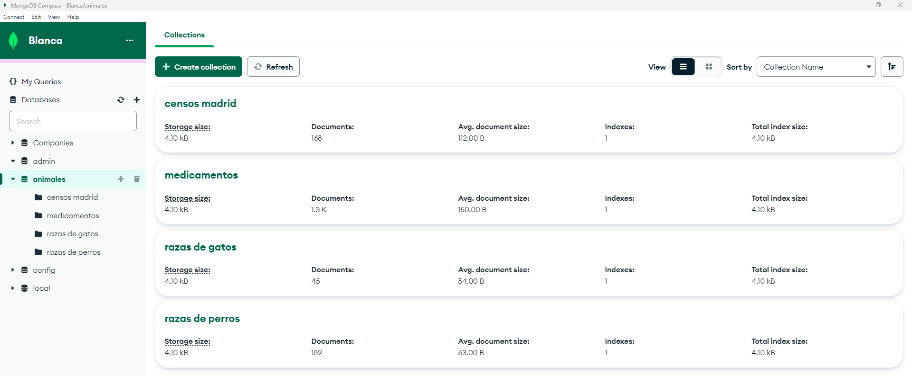

#  😺 Gatos y perros, censos y medicamentos 🐶 ETL_proyect

## Introducción 

En este proyecto vamos a observar diferencias entre los censos y razas de perros y gatos en Madrid, junto a los medicamentos autorizados en España para los mismos.

El objetivo es la obtención de datos de tres fuentes distintas, a través de dos medios de extracción de datos diferentes.

Para ello habrá que identificar las fuentes de las que queremos los datos, transformarlos y limpiarlos para que tengan sentido con respecto al análisis que queremos realizar y finalmente guardarlos en una base de datos. 

## Objetivos

- Extracción 
    - 3 fuentes distintas (kaggle, api, otros: web, pdfs, etc)
    - 2 métodos extracción (archivos: pdf, csv, xml, pg, etc.)
- Transformación para poder obtener queries
- Guardado en base de datos (sql o mongodb)

## Herramientas

- Python
- Selenium
- MongoDB

## Proceso

#### ⛏⏳ Extracción y transformación de datos para futuras queries

He obtenido y transformado la infomación de un archivo .xml sobre los medicamentos para animales en España convirtiendo el archivo en un diccionario e ir rebuscando hasta encontrar los datos que quería, en este caso el nombre del medicamento, si está comercializado o no y la especie de destino, que ya lo he filtrado a perros y gatos. Este diccionario lo convirtí a dataframe al final.

Tras esto, he sacado las razas de gatos y perros de la web de purina, utilizando selenium y obteniendo al final un dataframe.

Y finalmente he extraído los datos de un archivo .csv sobre los censos de perros y gatos de madrid, para convertir la info también en un dataframe.

#### 📚📊 Creación y carga de base de datos 

Al final de cada apartado del jupyter notebook anterior acabo guardando los datos de los dataframes en forma de archivos csv. Esos archivos ahora los voy a subir a MongoDB como colecciones dentro de una nueva base de datos denominada animales. Las colecciones se llaman censos madrid, medicamentos, razas de gatos y razas de perros.

Como bonus realizo dos queries una para ver solo los medicamentos comercializados en España y otra para ver los medicamentos únicamente de gatos.

## Links herramientas:

- [Documentación Python](https://www.w3schools.com/python/default.asp)
- [Documentación Selenium](https://selenium-python.readthedocs.io/)
- [Documentación MongoDB](https://www.w3schools.com/mongodb/index.php)

## Links recursos: 
- CIMAVET, AEMPS: agencia española de medicamentos y productos sanitarios.
    - Base de datos completa con el Nomenclátor de prescripción: ➡ [url](https://cimavet.aemps.es/cimavet/publico/nomenclator.html)
- Purina:
    - Razas de gatos ➡ [url](https://www.purina.es/encuentra-mascota/razas-de-gato?page=%2C0)
    - Razas de perros ➡ [url](https://www.purina.es/encuentra-mascota/razas-de-perro)
- Censo de animales domésticos en madrid ➡ [url](https://datos.madrid.es/portal/site/egob/menuitem.c05c1f754a33a9fbe4b2e4b284f1a5a0/?vgnextoid=3e573d68ae8a6410VgnVCM1000000b205a0aRCRD&vgnextchannel=374512b9ace9f310VgnVCM100000171f5a0aRCRD&vgnextfmt=default)

